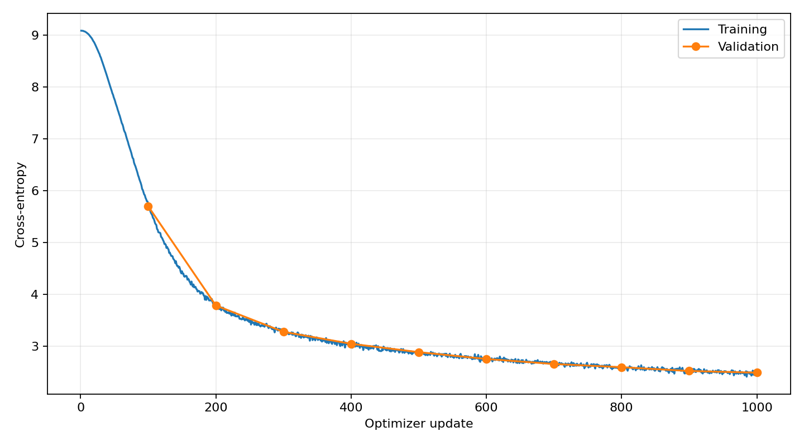
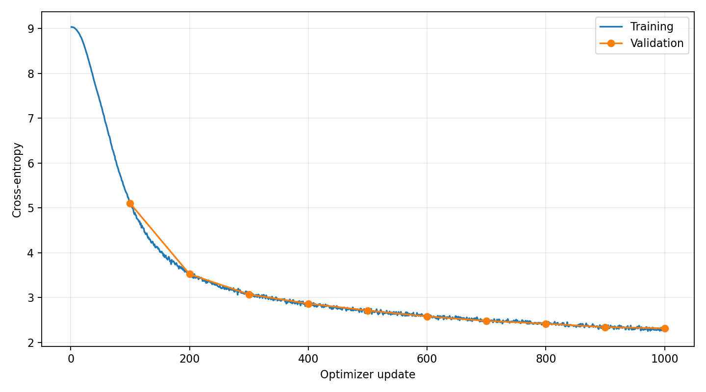
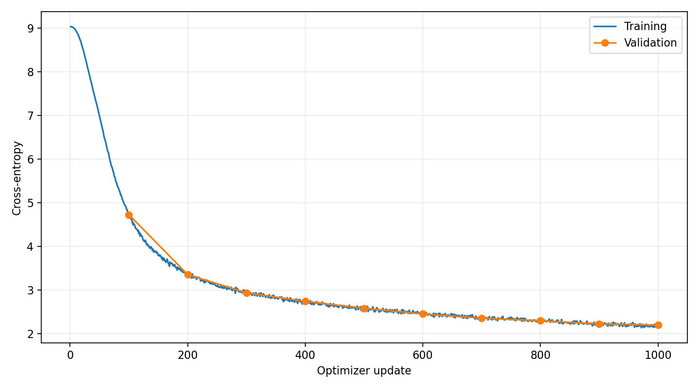

# Training and Inference Report

## 1. Training Hyperparameter Exploration

Learning rate was investigated because it directly affects how much progress the
model can make within the fixed budget of 10,000 optimizer updates. Short runs
compared peak learning rates of 2e-4, 3e-4, and 4e-4, with 4e-4 selected
for the final run. Each short run lasted 1,000 updates. The minimum learning rate
was one tenth of the peak, so this comparison scales the learning-rate schedule
rather than changing only its peak.

The controlled comparison between 3e-4 and 4e-4 used the same model architecture,
initialization seed of 42, training sampling seed of 42, and validation sampling
seed of 43. Both used 32 sequences per microbatch, eight accumulation steps,
200 warmup steps, and a cosine endpoint of 9,999. Validation ran every 100 updates
over 20 batches of 32 sequences. Keeping the cosine endpoint at 9,999 made these
runs follow the beginning of the full training schedule. Each run used 65,536,000
sampled token positions, giving an equal-update and equal-token comparison.

| Peak learning rate | Minimum learning rate | Validation loss at 200 updates | Validation loss at 500 updates | Validation loss at 1,000 updates | Training loss at 1,000 updates | Gradient norm at 1,000 updates |
|---|---|---:|---:|---:|---:|---:|
| 2e-4 | 2e-5 | 3.7857 | 2.8857 | 2.4904 | 2.4787 | 0.5607 |
| 3e-4 | 3e-5 | 3.5228 | 2.7123 | 2.3147 | 2.3266 | 0.4463 |
| 4e-4 | 4e-5 | 3.3555 | 2.5822 | 2.1986 | 2.2065 | 0.3993 |

Losses are cross-entropies in nats/token, and gradient norms are measured before
clipping. The final choice rests mainly on the controlled 3e-4 versus 4e-4
comparison.

Figure 1. The 2e-4 run learns steadily but reaches the highest
validation loss of the three short runs.

Figure 2. The 3e-4 baseline reaches a validation loss of 2.3147 after 1,000 updates.

Figure 3. Increasing the peak to 4e-4 produces faster early improvement and a
validation loss of 2.1986 after the same number of updates.

The 4e-4 run had lower validation loss than 3e-4 at every measured checkpoint.
At update 1,000, the difference was 0.1161 nats/token, about 5.0% of the baseline
loss. Its training loss was also lower, with no sustained loss spikes or growing
separation between training and validation. The maximum pre-clipping gradient
norm was 2.3127 for 4e-4 and 2.3062 for 3e-4. Clipping was needed on 77 and 88
updates, respectively. The larger learning rate therefore improved early learning
without an obvious loss of stability in this comparison.

The selected peak was 4e-4 with a minimum of 4e-5. This is supported by the short-run
trajectory, but it does not establish that 4e-4 is optimal after 10,000 updates.
The other learning rates were not trained for the full budget, and the controlled
comparison used one initialization seed.

The microbatch size of 32 with eight accumulation steps gives an effective batch
of 256 sequences. At 256 tokens per sequence, this is 65,536 tokens per optimizer
update. It preserves the recommended effective batch while requiring eight
forward and backward passes per update. No separate batch-size comparison was
performed, so the validation improvement cannot be attributed to this choice.

## 2. Final Training Run

### Preflight verification

A separate small-model check used the supplied course streams to verify the
training and validation routines. The check ran for 400 optimizer updates on CPU
in FP32, repeatedly optimizing one fixed minibatch of two 64-token sequences.
The model used the 8,192-token vocabulary, two Transformer blocks, model width
64, four query heads, two key/value heads, and SwiGLU hidden width 192.

Initialization and minibatch sampling used seed 142. AdamW used learning rate
3e-3, betas (0.9, 0.95), epsilon 1e-8, zero weight decay, and gradient clipping
at 1.0. Validation used seed 143 and two batches of two 64-token sequences.

| Preflight check | Result |
|---|---|
| Initial fixed-minibatch cross-entropy | 9.0082 nats/token |
| Final fixed-minibatch cross-entropy | 0.0000 nats/token, rounded to four decimal places |
| Small-model validation cross-entropy | 12.2721 nats/token |
| Validation executes under `torch.inference_mode()` | Passed |
| Model is in evaluation mode during validation | Passed |
| Previous training mode is restored after validation | Passed |

The sharp reduction in fixed-minibatch loss confirms that the small model can
memorize the batch and that the forward pass, loss, gradients, and optimizer work
together. Its high validation loss is consistent with fitting only 128 target
positions and does not measure the generalization of the final trained model.
The final minibatch loss rounds to zero at the displayed precision; it should
not be interpreted as an exactly zero loss. This check used a separate model
and left the final trained weights unchanged.

### Final model and training configuration

The final model has 19,272,192 parameters and uses the fixed architecture:

| Setting | Value |
|---|---:|
| Vocabulary size | 8,192 |
| Context and training sequence length | 256 |
| Transformer blocks | 4 |
| Model width | 512 |
| Query heads | 16 |
| Key/value heads | 4 |
| Head dimension | 32 |
| SwiGLU hidden width | 1,344 |
| RoPE base | 10,000 |
| RMSNorm epsilon | 1e-5 |

The model uses pre-RMSNorm, adjacent-pair RoPE, causal grouped-query attention,
and SwiGLU. Each key/value head serves four query heads. All linear projections
are bias-free, input embeddings and output weights are separate, and the model
does not use dropout.

Training used the supplied TinyStories token streams and fixed tokenizer. The
training stream contains 466,876,982 tokens from 2,119,719 stories, and validation
contains 4,692,376 tokens from 21,990 stories. Both files match the checksums in
the dataset metadata. The streams already contain an end-of-text token after
each story and are read as little-endian uint16 memory maps. Batches sample random
windows with replacement, and each target sequence is shifted one token ahead
of its input.

| Training setting | Value |
|---|---|
| Microbatch size | 32 sequences |
| Gradient accumulation | 8 microbatches |
| Effective batch | 256 sequences |
| Tokens per update | 65,536 |
| Optimizer updates | 10,000 |
| Optimizer | Custom AdamW |
| AdamW betas | (0.9, 0.95) |
| AdamW epsilon | 1e-8 |
| Weight decay | 0.1 |
| Peak learning rate | 4e-4 |
| Minimum learning rate | 4e-5 |
| Warmup endpoint | Step 200 |
| Cosine endpoint | Step 9,999 |
| Gradient clipping threshold | 1.0 |
| Initialization and training sampling seed | 42 |
| Training-time validation sampling seed | 43 |
| Validation interval | 500 completed updates |
| Training-time validation | 20 batches of 32 sequences |

The schedule uses zero-based steps, so the first update uses learning rate zero
and the 10,000th update uses 4e-5. Training ran on CUDA with FP16 autocast and
gradient scaling. Parameters remained in FP32, and cross-entropy was computed
from FP32 logits. Each microbatch loss was divided by eight before backpropagation,
and gradients were unscaled before clipping. An update skipped by the gradient
scaler did not advance the completed-update count.

The run completed the full 10,000-update budget in 6 hours, 17 minutes, and
31 seconds. The successful updates used 655,360,000 sampled token positions,
about 1.40 times the size of the training stream. This is not a count of unique
tokens or a literal number of epochs because sampling uses replacement. Skipped
attempts, if any, would add to the total tokens processed.

Checkpoints preserve the model, optimizer, gradient scaler, training and
validation generators, next update, and loss history. The final checkpoint has
`next_step = 10000`. Its first 1,000 training-loss, learning-rate, and gradient-norm
values match the 4e-4 short run. Validation values differ because the full run
evaluates every 500 updates, while the short run evaluates every 100 updates and
therefore consumes validation windows at different times.

Figure 4. Loss falls rapidly during early training and improves more slowly later.
Validation broadly follows training, with small fluctuations near the end.

| Completed updates | Training loss | Validation loss | Pre-clipping gradient norm |
|---|---:|---:|---:|
| 500 | 2.5505 | 2.6017 | 0.4327 |
| 1,000 | 2.2065 | 2.1654 | 0.3993 |
| 2,000 | 1.9469 | 1.9484 | 0.3568 |
| 4,000 | 1.7641 | 1.7693 | 0.3064 |
| 6,000 | 1.6424 | 1.6955 | 0.3149 |
| 7,500 | 1.6712 | 1.6394 | 0.3167 |
| 8,000 | 1.6406 | 1.6657 | 0.3175 |
| 9,000 | 1.5998 | 1.6392 | 0.3238 |
| 9,500 | 1.6350 | 1.6508 | 0.3200 |
| 10,000 | 1.6267 | 1.6497 | 0.3243 |

Training losses are means over the eight microbatches of the displayed update.
Validation losses average 20 batches, so the two columns represent different
samples and amounts of data. The final training value is not a whole-corpus mean.

Validation loss declined from 2.6017 at update 500 to 1.6497 at update 10,000.
Most improvement occurred early, followed by diminishing gains. The lowest
training-time validation loss was 1.6392 at update 9,000, only 0.0105 below the
last value. Since evaluations sample new windows, this small difference does not
by itself establish overfitting. The curve does not show a large, sustained gap
between training and validation. Only 77 of the 10,000 recorded updates required
gradient clipping, all within the first 1,000 updates.

Evaluation and generation use the model after 10,000 updates, keeping the full
training budget and the final model consistent across the experiments.

## 3. Final validation performance

The final evaluation used a fresh `torch.Generator` seeded with 42 and 100
validation batches, each containing 16 sequences of length 256. This evaluates
409,600 sampled token positions from the supplied validation stream. Evaluation
ran under `model.eval()` and `torch.inference_mode()`, with FP16 autocast for the
forward pass and FP32 logits for cross-entropy.

| Metric | Result |
|---|---:|
| Mean validation cross-entropy | 1.635051 nats/token |
| Perplexity | 5.129721 |

Perplexity was computed as `exp(mean validation cross-entropy)`, after averaging
all 100 batch losses. Per-batch perplexities were not averaged. The displayed
loss is rounded to six decimal places; perplexity uses the unrounded mean.

This loss is 0.0146 nats/token below the final training-time validation estimate
of 1.6497. The standardized evaluation uses more batches and an independent
sampling sequence, so a small difference is expected. The fresh generator also
makes this evaluation independent of the validation frequency used during
training.

The score measures next-token prediction on held-out text. The generated examples
show that this level of loss supports readable sentences but still leaves errors
in character identity, object consistency, and the connection between events.

These metrics were measured on the final model before exporting its parameters
to FP16. The exported weights exactly match the FP16 conversion of the final
checkpoint. A separate evaluation after reloading the exported file was not
performed.

## 4. Inference and Decoding Analysis

### Experimental setup

Two prompts examine different aspects of generation. "Once upon a time" allows
an open choice of characters and setting. "Mia found a shiny red box in the park."
establishes a character, object, and location, making changes in those details
easier to identify.

The temperature comparison uses 0.7, 1.0, and 1.2 with top-p fixed at 0.9. The
nucleus comparison uses top-p values of 0.7, 0.9, and 1.0 with temperature fixed
at 1.0. The shared setting gives five distinct combinations for each prompt and
ten experiments in total.

| Setting shared by all experiments | Value |
|---|---|
| Model | Final model after 10,000 optimizer updates |
| Sampling seed | 123, reset with a fresh device generator for each experiment |
| Maximum new tokens | 160 |
| Maximum context length | 256 tokens |
| Early stopping token | `<|endoftext|>` |
| Execution | Evaluation mode with `torch.inference_mode()` |

The decoder divides the final-position logits by temperature and applies
softmax. It then retains the smallest descending set of probabilities whose
cumulative mass reaches top-p, renormalizes that set, and samples the next token.
At each step, the model receives at most the latest 256 context tokens.

### Generated outputs

Each output below includes the input prompt followed by the complete generated
continuation. Generated wording, incomplete sentences, and end-of-text markers
are preserved.

#### Experiment 1: Temperature 0.7, top-p 0.9

**Prompt:** Once upon a time

**Values:** Temperature = 0.7; top-p = 0.9; seed = 123; maximum new tokens = 160.

**Generated output:**

> Once upon a time there was a little girl called Jane. She was very excited because she was going on an adventure. She was going to the beach with her family.
>
> When they arrived at the beach, they saw lots of people surfing. Jane asked her mom, "What is surfing?"
>
> Her mom replied, "That's a surf. People come from surfing to waves and make sandcastles."
>
> Jane was amazed. She asked, "Can I go surfing too?"
>
> Her mom said, "No, Jane. It's too big for you. You might trip over the waves."
>
> So Jane and her family went for a walk in the sand. Jane loved the way it looked on her face and the waves were so big! She even got to take a picture of the waves

#### Experiment 2: Temperature 1.0, top-p 0.9

**Prompt:** Once upon a time

**Values:** Temperature = 1.0; top-p = 0.9; seed = 123; maximum new tokens = 160.

**Generated output:**

> Once upon a time there was a green crown. He was a very old and fragile, but he was always very kind.
>
> One day, he decided to do something special. He wanted to fit into a long box of tools and fill it with wood. But it was so heavy he couldn't get it. He was too little to move but then a strong gust of wind blew and he dropped the box.
>
> But as soon as he was about to land, a naughty rabbit came by and scared him. He quickly hopped over to the box and hid.
>
> The king and the rabbit were stuck together. But the rabbit was determined and managed to finish quickly.
>
> When the rabbit finally figured out how to get the box to release the old crowns that were waiting for him.
>
> The

#### Experiment 3: Temperature 1.2, top-p 0.9

**Prompt:** Once upon a time

**Values:** Temperature = 1.2; top-p = 0.9; seed = 123; maximum new tokens = 160.

**Generated output:**

> Once upon a time there was a green crown. He went for a long walk through the forest. As he walked, he walked slow and slower. Soon, he reached a big leaf. He loved it so much he just kept wandering around it.
>
> But as he reached for the green leaf, an old cat came along. He asked it how it was so gray and not stepped on the leaf. The cat said it didn't fit in the snap, and a nasty find the colour of it. He scrunched his nose, but he knew he had to take home.
>
> He never found out this strange noise! That night, he remained very still and did not know how the noise finally went. The hairy head stayed there and never touched the leaf again.
>
> The cat went far out every

#### Experiment 4: Temperature 1.0, top-p 0.7

**Prompt:** Once upon a time

**Values:** Temperature = 1.0; top-p = 0.7; seed = 123; maximum new tokens = 160.

**Generated output:**

> Once upon a time, there was a little boy named Timmy. Timmy loved to play with his toys all day long. One day, Timmy's mom told him they were going to visit his grandma. Timmy was excited because he loved his grandma very much.
>
> When they arrived at grandma's house, Timmy ran to the living room to see her. She saw that her grandma had made a special breakfast for her. Timmy was excited to see her and his grandma's knitting. He sat down at the table and started eating his cereal.
>
> After breakfast, Timmy's grandma gave him a big hug and told him he was very proud of him. Timmy felt happy and loved his grandma's voice. From that day on, Timmy would always look at his mom's breakfast when they got a snack.<|endoftext|>

#### Experiment 5: Temperature 1.0, top-p 1.0

**Prompt:** Once upon a time

**Values:** Temperature = 1.0; top-p = 1.0; seed = 123; maximum new tokens = 160.

**Generated output:**

> Once upon a time there was a green crown. He was a very old and fragile creature. He was always very curious and tried to find something new with the crown.
>
> One day, he found a copper sword in his yard. He thought it might make it real if he took it. So he put it in his pretend castle and it shone in his head. He wanted to show everyone that he was brave and strong and no one could do it. So he started loading different trees and build a crowns.
>
> He brought lots of sticks and rocks to each piece. He made the crown bigger and even bigger! But then he heard a loud snap. He kept on lifting until his crown appeared in his head.
>
> He was so surprised. But deep, the crown was no longer moving backwards in

#### Experiment 6: Temperature 0.7, top-p 0.9

**Prompt:** Mia found a shiny red box in the park.

**Values:** Temperature = 0.7; top-p = 0.9; seed = 123; maximum new tokens = 160.

**Generated output:**

> Mia found a shiny red box in the park. She opened it and saw many pretty things inside. There were books, toys, clothes, and a big cross.
>
> Mia wanted to play with the cross, but she did not know how. She looked around and saw a small boy. The boy had a red ball and he was playing with the ball. Mia ran to the ball and said, "Hi, I'm Mia. Do you want to play with me?"
>
> The boy looked at Mia and said, "No, I don't want to play with you. I'm playing with my ball. Go away, Mia."
>
> Mia felt sad and angry. She said, "That's not fair. You always share. You are not my friend. You are mean and rude."
>
> The boy felt angry and

#### Experiment 7: Temperature 1.0, top-p 0.9

**Prompt:** Mia found a shiny red box in the park.

**Values:** Temperature = 1.0; top-p = 0.9; seed = 123; maximum new tokens = 160.

**Generated output:**

> Mia found a shiny red box in the park. It was the star. She picked it up and carried it with her.
>
> Mia was sad. She did not know where the star came from. She looked around and saw a man. The man was talking on a bench. He said, "What do you have there, little girl?" Mia said, "I found this shiny star in the grass. I hope it is your star."
>
> The man looked at Mia and said, "It is, my dear. I have a star for you. Do you want to keep it?" Mia nodded. She said, "Yes, please. I want it." The man opened the bracelet and gave her a shiny star.
>
> Mia hugged the star and said, "Thank you, little star. You are very pretty and bright

#### Experiment 8: Temperature 1.2, top-p 0.9

**Prompt:** Mia found a shiny red box in the park.

**Values:** Temperature = 1.2; top-p = 0.9; seed = 123; maximum new tokens = 160.

**Generated output:**

> Mia found a shiny red box in the park. It was from her mom, dad, her dad's neighbor and Spot. They gave her the box and followed the driver.
>
> They walked slowly to the hill. They counted to ten and one by one. Then they pushed the buttons harder and turned around to see a roller coaster. They got the box of ribbons and swung the key at Spot.
>
> "Bang, bang, bang!" Ben and Mia shouted. "We got tangled up!"
>
> "Stop, silly, stop, you bit my nose!" Spot cried. "You are under a wheelchair!"
>
> They were having fun, but they were very tired. They stopped swinging and walked back to the wagon. They told their mom and dad what happened and hoped someone would give them some gifts soon.

#### Experiment 9: Temperature 1.0, top-p 0.7

**Prompt:** Mia found a shiny red box in the park.

**Values:** Temperature = 1.0; top-p = 0.7; seed = 123; maximum new tokens = 160.

**Generated output:**

> Mia found a shiny red box in the park. She opened it and saw many pretty things inside. There were books, toys, clothes, and more. She was very happy.
>
> Mia took the box home and showed it to her mom. Her mom said, "Mia, you have a beautiful room in your room. Can you show me the new room?" Mia nodded and smiled. She loved her new room. She wanted to see what was inside the box.
>
> She opened the box and took out a soft, colorful doll. She gave it to Mia and said, "This is a very pretty doll. She is very pretty and very cute. I love her." Mia hugged the doll and thanked her mom. She said, "Thank you, mom. I love you. And I love my new doll. And I love

#### Experiment 10: Temperature 1.0, top-p 1.0

**Prompt:** Mia found a shiny red box in the park.

**Values:** Temperature = 1.0; top-p = 1.0; seed = 123; maximum new tokens = 160.

**Generated output:**

> Mia found a shiny red box in the park. It was cozy and warm and it had a bow!
>
> E Sunny was very excited. He brought the box to the park every week and put it on the grass. Finally, he found a very pretty green leaf.
>
> "I made my scarf for my friend," said Liz.
>
> Especially his friend, Adam. "Wow! Look how pretty my scarf is!"
>
> Earman grinned. "Thank you!" he said.
>
> Elsie was very happy. He thought it must be the most special scarf he had ever had.<|endoftext|>

### Interpretation of results

#### Effect of temperature

At top-p 0.9, temperature 0.7 produces the most readable pair of continuations
in this comparison. Experiment 1 maintains Jane, her family, and the beach as
its main subjects. The sequence of arriving, asking about surfing, and walking
on the sand is easy to follow. However, the explanation "People come from surfing
to waves and make sandcastles" is confused. Experiment 6 develops a recognizable
conflict over sharing a ball, but abandons the box and includes the contradictory
complaint "You always share" after the boy refuses to share. Lower temperature
therefore supports local readability without ensuring logical consistency.

At temperature 1.0, the open prompt in Experiment 2 introduces a green crown
as a character, then shifts between a crown, a king, and a rabbit. The actions
involving the box have weak causal connections. Experiment 7 changes Mia's box
into a star immediately and later introduces a bracelet without explaining how
these objects relate. Both samples contain readable stretches of dialogue or
narration, but fail to preserve the identities of central objects and characters.

Temperature 1.2 increases variation while weakening continuity in these samples.
Experiment 3 contains malformed phrases such as "a nasty find the colour of it"
and introduces a noise and a hairy head without a clear connection to the leaf.
Experiment 8 moves among a driver, a hill, a roller coaster, ribbons, a key, and
a wheelchair. Its final paragraph resembles a story ending, but the preceding
events do not establish a coherent sequence. A plausible closing sentence alone
does not make the entire story consistent.

Dividing logits by a lower temperature concentrates probability on more likely
tokens. Increasing temperature makes less likely choices more accessible, which
helps explain the greater variety of events and expressions at 1.2. These samples
show that the additional variety often introduces errors instead of improving
the story.

#### Effect of top-p

At temperature 1.0, top-p 0.7 gives the clearest narrative structure among the
three nucleus settings for the open prompt. Experiment 4 follows Timmy's visit
to his grandmother and reaches an end-of-text token. It still switches pronouns
from "he" to "she", and its closing statement about breakfast does not follow
naturally from the visit. Experiment 9 remains closer to the box and a doll,
but includes "a beautiful room in your room" and repeated declarations of affection.
Restricting the nucleus improves predictability in these examples while leaving
repetition and reference errors unresolved.

At top-p 0.9, Experiments 2 and 7 permit a broader set of choices but lose track
of the central crown and box. Neither continuation establishes a clear resolution
before reaching the token limit. Their readable sentences do not compensate for
the changes in characters and objects across the story.

At top-p 1.0, all tokens remain eligible for sampling. Experiment 5 combines a
crown, a sword, trees, sticks, and rocks with unclear actions, including "loading
different trees and build a crowns". Experiment 10 abandons Mia, introduces
E Sunny, Liz, Adam, Earman, and Elsie, and finishes with a scarf. It reaches an
end-of-text token, but character and object continuity are particularly weak.
The unrestricted distribution produces more unusual wording in these examples
without producing a better connected narrative.

#### Readability, repetition, and completion

| Temperature | Top-p | Open prompt | Mia prompt |
|---|---|---|---|
| 0.7 | 0.9 | Consistent beach setting; confused explanation of surfing | Readable sharing conflict; box abandoned and dialogue inconsistent |
| 1.0 | 0.9 | Crown, king, and rabbit references become confused | Box changes into a star; bracelet appears without explanation |
| 1.2 | 0.9 | More grammatical errors and unrelated details | Varied events with weak connections |
| 1.0 | 0.7 | Recognizable grandmother visit; pronoun errors | Box and doll remain central; repeated phrases and unclear references |
| 1.0 | 1.0 | Unclear construction actions and malformed wording | Frequent character changes; box replaced by scarf |

Temperature 0.7 with top-p 0.9 provides the strongest balance of readability and
variation across these two prompts. Top-p 0.7 at temperature 1.0 also gives
recognizable story structures, but repeated phrases remain a problem. None of
the settings consistently preserves all characters, objects, and causal links.
The model has learned the sentence patterns and dialogue of short children's
stories more reliably than it has learned to sustain their logic.

Experiments 4 and 10 stop with an explicit `<|endoftext|>` marker. The remaining
eight reach the 160-token limit, several in the middle of a sentence. These
cutoffs reflect the generation budget and should be distinguished from endings
chosen by the model. Conversely, reaching end-of-text does not establish story
quality, as Experiment 10 demonstrates.

The comparison uses one sample per prompt and setting with a common seed.
Resetting the seed controls the sampling setup, but different settings change
the token probabilities and subsequent contexts. The observations support a
preference within these ten examples; more prompts and seeds would be needed
to establish a reliable ranking. The complete samples are also retained in
[the generation examples](report_assets/sample_generated_text.txt).

## Submitted Artifacts

- `final_model.pt` contains the model after 10,000 updates as a plain CPU state
  dictionary. All tensors are FP16, with 19,272,192 values in total. The weights
  match the FP16 conversion of the final training checkpoint and contain no
  optimizer or generator state.
- `report_assets/training_loss.png` shows the full training run.
- `report_assets/ablation_lr_2e4.png`, `report_assets/ablation_lr_3e4.png`, and
  `report_assets/ablation_lr_4e4.png` show the learning-rate comparisons.
- `report_assets/sample_generated_text.txt` contains the ten decoding examples
  generated from the final trained model.
