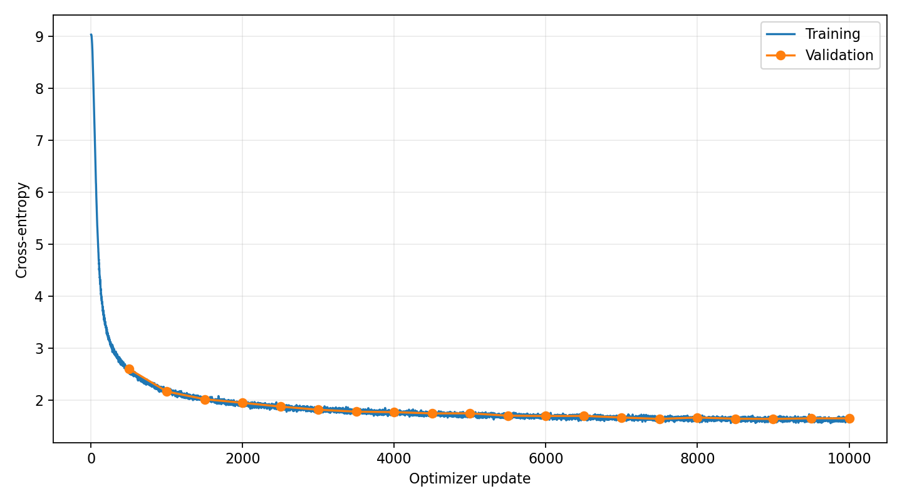

# Training and Inference Report

This report should document and analyze the decisions you made while training and
evaluating your Transformer language model.

The goal is not to follow a prescribed sequence of experiments. Instead, use the
report to explain your experimental process, the evidence that informed your
decisions, and what you learned about the behavior of your model.

You may use tables, plots, generated samples, or other quantitative evidence
wherever they help support your discussion. Figures should be placed under
`report_assets/`.

The final model, training results, and generated samples discussed in this report
must all correspond to the same final trained model.

## 1. Training Hyperparameter Exploration

Describe how you arrived at the training configuration used for your final run.

Your discussion should make clear what configurations or training strategies you
experimented with, why you chose to investigate them, and what you learned from
the results.

Include enough quantitative evidence to support your conclusions. For example,
you may compare validation-loss curves, training-loss curves, gradient norms,
learning-rate schedules, or other quantities that were useful during your
experiments.

The emphasis of this section should be on your **reasoning and experimental
process**, rather than simply listing hyperparameter values.

**Your response here:**

The training configuration followed the recommended starting values. The main
practical choice was to use 32 sequences per microbatch and accumulate gradients
over eight microbatches. With a sequence length of 256, this gives
32 × 8 × 256 = 65,536 tokens per optimizer update. It preserves the effective
batch size of 16 sequences accumulated over 16 microbatches while using fewer
forward and backward passes per update.

Training used a Tesla T4 with FP16 autocast and gradient scaling. Model parameters
remained in FP32, and cross-entropy was computed from FP32 logits. This allowed
mixed precision training while keeping the loss reduction in FP32. Gradients
were unscaled before clipping.

| Setting | Value |
|---|---|
| Microbatch size | 32 sequences |
| Gradient accumulation | 8 microbatches |
| Sequence length | 256 tokens |
| Optimizer updates | 10,000 |
| Optimizer | Custom AdamW |
| AdamW betas | (0.9, 0.95) |
| AdamW epsilon | 1e-8 |
| Weight decay | 0.1 |
| Peak learning rate | 3e-4 |
| Final learning rate | 3e-5 |
| Warmup | 200 updates |
| Cosine schedule endpoint | Step 9,999 |
| Gradient clipping threshold | 1.0 |
| Initialization and training sampling seed | 42 |
| Training-time validation sampling seed | 43 |

The loss curve supports the use of this configuration: validation loss declined
from 1.6920 at update 3,000 to 1.4842 at update 10,000. The displayed gradient
norms at these checkpoints were 0.37 and 0.36, respectively, below the clipping
threshold. These observations show continued learning without visible divergence
in the recorded part of the run.

The saved results contain one training configuration, not a controlled comparison
of different learning rates, batch sizes, or optimizers. Therefore, they do not
establish that this configuration is optimal, or that changing microbatch size
improved speed or validation performance. The evidence supports a working
configuration, but a broader hyperparameter study remains a limitation.

## 2. Final Training Run

Describe the final training run using the configuration you selected.

Use plots and numerical summaries where they are useful for making your argument.

**Your response here:**

The model has 19,272,192 parameters, with an 8,192-token vocabulary, four
Transformer blocks, a model width of 512, and a SwiGLU hidden width of 1,344.
Attention uses 16 query heads and four key/value heads. The implementation uses
pre-RMSNorm, RoPE with a base of 10,000, bias-free projections, and separate input
embedding and output matrices.

The notebook reads TinyStories V2 GPT4 text from Kaggle and encodes it with the
provided tokenizer. Each story is followed by an end-of-text token. The resulting
streams contain 544,442,942 training tokens and 5,498,516 validation tokens.
They are stored as little-endian uint16 files and accessed through memory maps.
Training batches are sampled as random windows, with targets shifted by one token.

This data preparation differs from the manual's supplied pretokenized streams.

During setup, the original tokenizer and data preparation workflow caused the
Kaggle notebook to stall and report out-of-memory errors. As a practical workaround,
I used the Kaggle text files and tokenized them in chunks with the supplied
tokenizer. This reduced the amount of text held in memory at once and allowed
the run to proceed. I did not isolate the exact cause of the earlier failures,
so this workaround should not be interpreted as evidence of a problem with the
supplied tokenizer itself.

The results below describe the Kaggle text processed by this notebook. They should
not be treated as a verified evaluation on the supplied course validation stream.

The run completed 10,000 optimizer updates. At 65,536 tokens per update, the
successful updates used 655,360,000 sampled token positions. This is not a count
of unique tokens because windows are sampled with replacement. Any attempts
skipped by the gradient scaler would add to the actual number of tokens processed.

Validation ran every 500 updates using 20 batches of 16 sequences. Checkpoints
saved the model, optimizer, gradient scaler, sampling generators, next update,
and training history. The saved notebook shows a resume from update 2,500 and
completion at update 10,000. The resumed portion took 3 hours, 52 minutes, and
30 seconds; this is not the duration of the complete run.

Figure 1. Training loss falls rapidly at the beginning and improves more slowly
later. Validation loss generally follows training loss, with small fluctuations
between evaluations.

| Update | Training loss | Validation loss |
|---|---:|---:|
| 3,000 | 1.655 | 1.6920 |
| 4,000 | 1.609 | 1.6238 |
| 6,000 | 1.532 | 1.5041 |
| 8,000 | 1.492 | 1.4959 |
| 9,500 | 1.487 | 1.4797 |
| 10,000 | 1.457 | 1.4842 |

Losses are in nats/token. Training values are averages over the microbatches of
the displayed update, while validation values average 20 batches. The final
training loss is therefore not an average over the whole training set.

The final validation loss is slightly higher than the value at update 9,500.
Since each evaluation samples new windows, this small difference alone does not
establish overfitting. The overall curve shows diminishing improvements and no
large, sustained separation between training and validation loss. Evaluation,
generation, and export use the model at update 10,000.

## 3. Final validation performance

Evaluate the final model on the validation set and report its validation
cross-entropy and perplexity.

For the standardized evaluation, use a fresh `torch.Generator` seeded with 42
and evaluate over 100 validation batches of 16 sequences of length 256.

Report:

- mean validation cross-entropy in nats/token;
- perplexity computed as

**PPL = exp(mean validation cross-entropy)**

Do not average separately computed per-batch perplexities.

**Your response here:**

After training, a fresh `torch.Generator` seeded with 42 sampled 100 validation
batches. Each batch contained 16 sequences of length 256, giving 409,600 evaluated
token positions. Evaluation used `model.eval()` and `torch.inference_mode()`.
Forward passes used FP16 autocast, and loss was computed from FP32 logits.

| Metric | Result |
|---|---:|
| Mean validation cross-entropy | 1.482880 nats/token |
| Perplexity | 4.405615 |

Perplexity was calculated as `math.exp(final_loss)` after averaging the batch
cross-entropies. Per-batch perplexities were not averaged. The printed loss is
rounded to six decimal places; perplexity was computed from the unrounded mean.

This result is close to the final training-time validation loss of 1.4842, despite
using a fresh generator and more batches. It measures next-token prediction and
does not by itself demonstrate that generated stories remain logically consistent.
The decoding examples in Section 4 examine that behavior directly.

The batch sizes and random seed follow the requested evaluation procedure, but
the validation tokens come from the retokenized Kaggle text described in Section 2.
The reported metrics were measured before exporting the weights to FP16. The
notebook does not record a separate evaluation after reloading `final_model.pt`.

## 4. Inference and Decoding Analysis

Investigate how the behavior of your trained model changes under different
decoding strategies.

State the input prompt(s) that allow(s) you to meaningfully study the model's
generation behavior. Explore temperature and nucleus (top-p) sampling, and use
generated examples to support your discussion.

Include representative generated examples. Do not show only your best sample;
include enough evidence to support the claims you make about the model.

**Your response here:**

Two prompts were used:

1. "Once upon a time"
2. "Mia found a shiny red box in the park."

The first prompt leaves the setting and characters open. The second introduces
a named character, object, and location, making it easier to observe whether the
model preserves details from the prompt.

For each prompt, temperature was varied across 0.1, 0.3, 0.5, 0.7, 1.0, 1.2,
1.5, and 2.0 with top-p fixed at 0.9. Top-p values of 0.7, 0.9, and 1.0 were
also compared at temperature 1.0. Each generation used a new sampling generator
seeded with 123 and a maximum of 160 new tokens. Generation stopped early if an
end-of-text token was sampled. This produced 20 examples in total.

Lower temperatures concentrate probability on more likely tokens. Higher
temperatures allow more varied choices, but can also increase grammatical and
logical errors. Temperature 0.1 still uses sampling; it is not greedy decoding.

### Temperature comparison

At temperatures 0.1 to 0.5, the stories mostly used familiar characters, simple
sentences, and repeated objects such as a red ball. Low temperature did not
guarantee consistency. With the Mia prompt at temperature 0.1 and top-p 0.9,
the box became a ball without explanation:

> Mia ran to Tom's house and said, "Look, Tom! I found a big red ball!" Tom looked at the ball and said, "Wow, that's a big red ball! Let's play with it!"

Temperature 0.3 produced a more imaginative but understandable continuation of
the same prompt:

> But then, something unexpected happened. The ball started to talk! It said, "Thank you for finding me! I am a magic ball, and I can grant you one wish."

At temperature 0.7 and top-p 0.9, both examples had a clear sequence of events.
The open prompt produced a story about Tim and Sue playing and sharing food:

> After a while, Tim and Sue got hungry. They went to Tim's house to eat. They shared the food and played with their toys. They were very happy and became good friends.

The Mia example at this setting kept the box and the toy found inside it central
to the story. For these prompts, 0.7 gave a useful balance between readable text
and variation.

Temperature 1.0 produced more uneven results. The Mia story remained readable,
but shifted between balls and a balloon. The open prompt ended with an unrelated
and grammatically incorrect request:

> The store lady said, "You can have some juice for now, but first, you need to give your sister two coffee!"

At temperatures 1.2 and 1.5, the text showed more abrupt changes, inconsistent
characters, and malformed phrases. For example, the open prompt at 1.5 included:

> The doctor table feeling scared, it still crying. Little saw Fred blocking talking because anyone loved him.

At temperature 2.0, both samples largely lost sentence structure. The Mia example
began its continuation with:

> Anne blinked began covering drops shook heat hard everyday threw them for it every tug someday while forgetting closer cherriesing

These samples show that greater randomness did not consistently produce useful
creativity. At the highest temperatures, errors dominated the output.

### Top-p comparison

At temperature 1.0, top-p 0.7 produced mostly readable text but still allowed
repetition. The Mia example contained:

> She put the jewelry in her pocket and kept it in her pocket.

Top-p 0.9 allowed a wider range of choices, but the examples still contained
object changes and weak causal connections. With top-p 1.0, no nucleus filtering
was applied. The open prompt included the malformed word "wildbbies", and the
Mia example ended with confused actions and references:

> She showed the box to Mia, who licked it to show her. Mia said, "You did a great job, Miss Lilly!"

The complete outputs are available in
[the saved generation examples](report_assets/sample_generated_text.txt).
Some examples end without an end-of-text marker and stop mid-sentence because
generation is limited to 160 new tokens.

Overall, moderate temperature with nucleus sampling gave the most readable
examples in this study. However, only one sample was generated per prompt and
setting, using the same seed. These observations describe the saved examples;
they are not a statistical comparison across many prompts or random seeds.

## Submitted Artifacts

Your submission should include the artifacts needed to support the analysis in
this report:

- `final_model.pt`
- figures/visualizations used in this report under `report_assets/`

`final_model.pt` should contain the FP16 CPU state dictionary corresponding to
the final model analyzed in this report.
